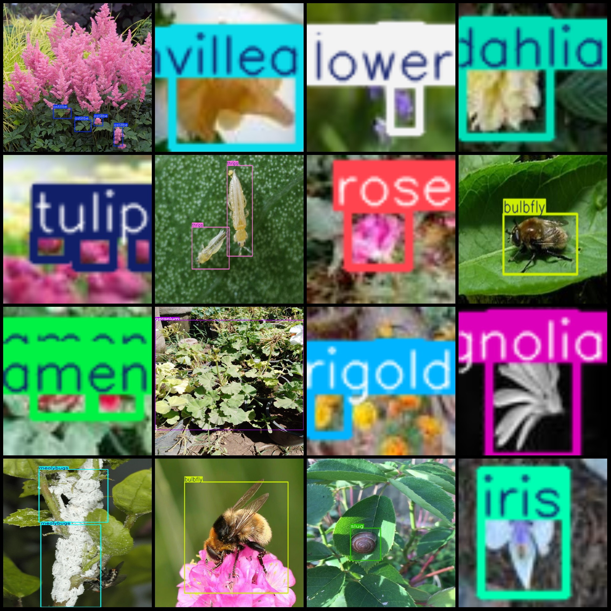
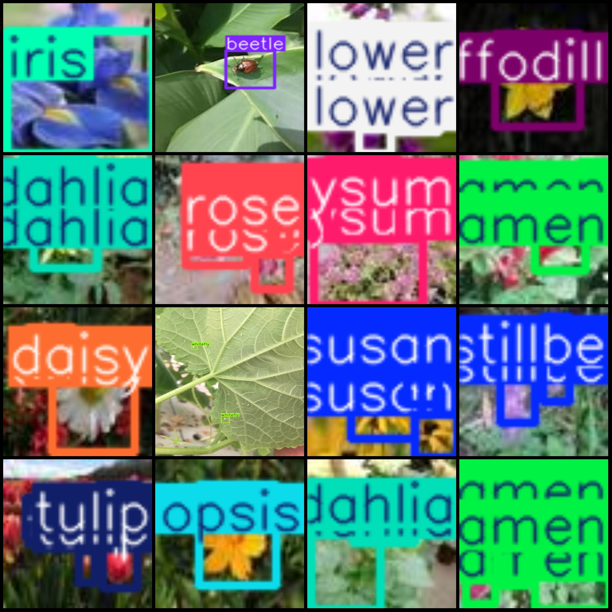

# Vegetable and Pest Disease Detection Dataset VOC+YOLO Format, 2199 Images, 44 Categories

Dataset format: Pascal VOC format + YOLO format (txt file not containing segmentation paths, only containing jpg images and corresponding VOC format xml files and YOLO format txt files)
Number of images (jpg file count): 2199
Number of annotations (xml file count): 2199
Number of annotations (txt file count): 2199
Number of categories: 44
Number of boxes per category:

$$ x + 163 $$

Without additional information, we cannot determine the value of "xiang xue qiu".
Aphid = 77
astillbe = 258
The word "beetle" can be translated to "cricket" in English, which has a value of 61 in the dictionary.
"Bellflower = 144" is a mathematical expression that represents the number of bellflowers in a specific context. The number 144 is often associated with the number of petals on a flower, and in this case, it refers to the number of petals found in a single bellflower plant.

In mathematics, when you have an equation like this:

$$
\text{Number of bellflowers} = 144
$$

You're essentially stating that there are 144 bellflowers in total. This can be used in various contexts, such as counting the number of bellflowers in a garden, calculating the cost of bellflowers based on their quantity, or determining the number of bellflowers needed for a particular task.
Bellflower_L = 4
The number 338 is the code for "black eye Susan".
Black Eyed Susan L = 33
Bougainvillea is a species of flowering plant in the family Cactaceae. It is native to tropical regions, such as South Africa and Brazil. The flowers are brightly colored and come in shades of red, pink, purple, yellow, and white. The leaves are also colorful, with some varieties having deep green leaves that turn red in the fall. Bougainvillea is known for its profuse blooms and long-lasting petals, making it a popular choice for home gardening and outdoor decorating.
"Bougainvillea_L" is a genus of the flowering plant family, Asteraceae. It has been scientifically classified as "Euphorbiaceae."

The specific epithet "L" means that it belongs to the species "Laurustii," which was first described by the Swedish botanist Carl Linnaeus in 1753. The name "Laurus" comes from the Latin word for laurel, and "Laurustii" refers to the laurescent leaves of the plant.

In terms of its characteristics, Bougainvillea L is a tropical plant that thrives in warm, humid environments. It has large, showy flowers that bloom throughout the year, making it a popular choice for home gardens and landscapes. The plant is also known for its vibrant foliage and ability to tolerate various soil conditions.
Bulbfly = 47
Calendula = 3
Calendula = 170
The number 73 is the sum of the first seven letters of the word "carnation".
The caterpillar is a type of insect that is known for its ability to eat and digest large amounts of food. It is also the larval stage of many other insects, such as butterflies and moths. The number 44 is not related to the caterpillar or any other specific insect or animal.
The English translation for "Commondaisy = 203" is "Common Daisy (Common Daisy) = 203".
Coreopsis is a genus of flowering plants in the Asteraceae family. It has a wide range of species, including some that are native to North America. The common name "coreopsis" comes from the Greek word "kouros," which means "golden."
Cyclamen is a genus of flowering plants in the primrose family, Asteraceae. The genus name "Cyclamen" comes from the Greek word "kyklas," meaning "to be clear or distinct," and refers to the distinct flowers that are characteristic of this plant. The species names are derived from the Latin "cyclas," meaning "cup" or "bowl," as the flowers are shaped like bowl-shaped petals.

The Cyclamen genus contains about 150 species of flowering plants, distributed across North America, Europe, Asia, and Australia. They are known for their beautiful white or pink flowers, which bloom during the winter months when other plants are dormant. The flowers have a distinctive trumpet shape with five petals that open up at night and close during the day. Some species of Cyclamen are also known for their fragrant scents and attractive foliage.

In traditional Chinese medicine, Cyclamen has been used for its medicinal properties, including its ability to stimulate blood circulation and improve skin health. It is also believed to have anti-inflammatory and anti-spasmodic effects, making it useful for treating conditions such as rheumatism and arthritis.

Overall, Cyclamen is a fascinating genus of flowering plants that offers a range of benefits for both people and nature.
Cyclamenmites = 13
Daffodill = 118
Dahlia = 89
The number 157 is a prime number.
Dandelion = 82
geranium box count = 228
Iris box count = 77
Leafhoppers (or "leaf-hoppers") are tiny insects that feed on the leaves of plants. They are often found in orchards and gardens. The number of leafhoppers in a particular area is determined by several factors, including the type of plant they feed on, the season, and other environmental conditions. Leafhopper counts are used to assess the health of a particular plant or crop, as well as to monitor the effectiveness of pest control methods.
leafminer box count = 16
Magnolia box count = 169
marigold box count = 458
Mealybugs (also known as mealybugs or muscoid mealybugs) are small, soft-bodied insects that feed on the sap of plants. They are a common problem in gardens and orchards, especially during the spring and summer months when they emerge from their overwintering eggs. Mealybugs can cause significant damage to plants by sucking their sap, leaving behind sticky, white, or yellowish-brown patches on leaves and stems. In addition to causing aesthetic damage, mealybugs can also transmit plant diseases such as powdery mildew and black spot.

The number of mealybugs present on a plant is often referred to as the "box count," which refers to the number of boxes (or containers) containing adult mealybugs that can be counted. A typical box count for mealybugs is between 10 and 50. However, some species of mealybugs may have higher numbers of adults per box, while others may have fewer. The exact number of adult mealybugs present on a plant can vary depending on the season, weather conditions, and other environmental factors.

To control mealybugs, it is important to identify the species of mealybugs that are present and take appropriate measures to prevent their reproduction and spread. Common methods of controlling mealybugs include:

- Using natural predators such as ladybugs, lacewings, and parasitic wasps to attack and kill adult mealybugs.
- Applying insecticidal soaps or sprays to disrupt their feeding behavior and kill them.
- Encouraging beneficial insects such as ladybugs and lacewings to eat the mealybugs.
- Using traps or sticky cards to catch adult mealybugs and release them into the wild.
- Maintaining healthy plant growth and preventing overcrowding, which can create an environment conducive to mealybug breeding.

In summary, mealybugs are small, soft-bodied insects that can cause significant damage to plants by sucking their sap. Controlling mealybugs involves identifying the species present, using natural predators, insecticidal soaps or sprays, and other methods to disrupt their feeding behavior and kill them. By taking appropriate measures to prevent their reproduction and spread, we can help maintain healthy plant growth and prevent damage caused by these pesky pests.
Pansy box count = 165
The number of Primula boxes is 345.
The number of rananculus boxes in a box count is 63.
Rose box count = 267
Rose_L box count = 23
slug box count = 50
Spider mite (red spider/leaf mite) box count = 29
sunflower box count = 192
sunflower_L (Sunflower L) box count = 4
The count of thrips (leafhoppers) in the box is 84.
Tulips, also known as tulips, are a type of flower commonly cultivated in the Netherlands. The number 192 in this context likely refers to the total number of tulip bulbs that were planted or purchased during a particular time period.
Water lilies (Nymphaea) box count = 142
Weevil, also known as the "Box Count" is a term used in statistics to describe the number of observations in a sample. In this case, the box count is 24, which means that there are 24 observations in the sample.
Whitefly (aphids) count = 138.
total boxes: 5308  
Image resolution: Multi-resolution images, such as 56x56, 600x800, etc.
## Images

Here is a pay link on Stripe ( https://buy.stripe.com/3cs8yP7sY87d0vu9AB ). Please contact me lonlonago@foxmail.com after funding $89, and I will send you a complete data files , thank you!

